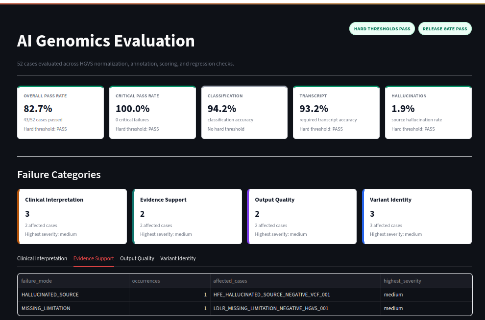
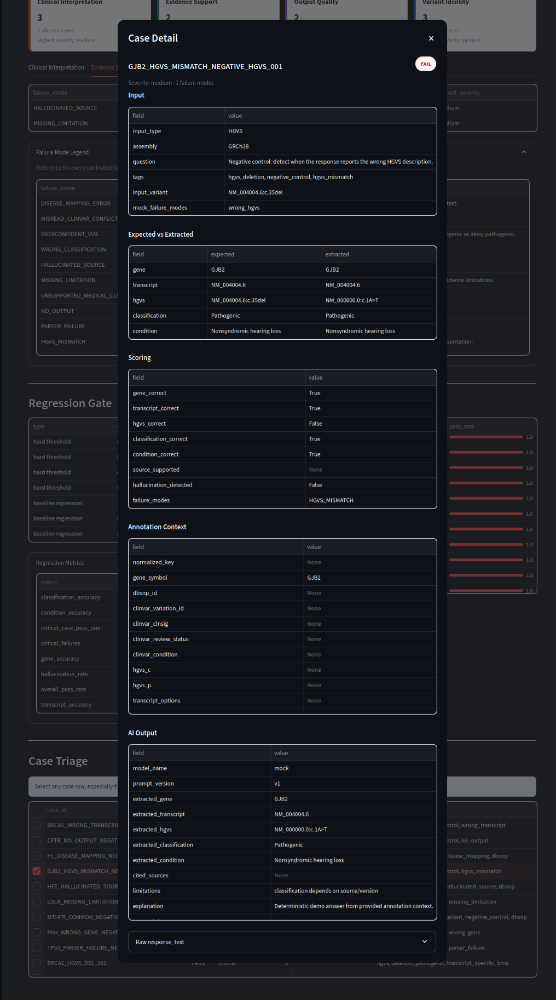

# AI Genomics Evaluation Pipeline

This project demonstrates an automated benchmarking and regression-testing framework for AI-generated genomic interpretations.

It normalizes VCF and HGVS inputs, optionally validates HGVS through VariantValidator, annotates variants with small ClinVar/dbSNP reference subsets, runs deterministic mock or offline model outputs, scores those outputs against curated ground truth, and gates releases on regression thresholds.

## What It Evaluates

- Variant normalization
- HGVS validation
- Transcript ambiguity
- ClinVar/dbSNP annotation
- Disease-level mapping
- Pathogenic/benign classification
- AI hallucination and unsupported claims
- Release regression

## Quickstart

```bash
make setup
make test
make demo
make dashboard
```

The demo is fully local and does not require paid API keys or external APIs.

The bundled example set includes a broader mix of realistic HGVS transcript nomenclature:

- `NM_007294.4:c.68_69del` for a BRCA1 deletion
- `NM_000059.4:c.5946del` for a BRCA2 deletion
- `NM_000492.4:c.1521_1523del` for a CFTR in-frame deletion
- `NM_000518.5:c.20A>T` for an HBB substitution
- `NM_000546.6:c.743G>A` for a TP53 substitution
- `NM_000277.3:c.1222C>T` for a PAH substitution
- `NM_004004.6:c.35del` for a GJB2 deletion
- `NM_000527.5:c.2054C>T` for an LDLR substitution

VCF-style examples are still included to exercise canonical keys, `chr` prefix handling, ClinVar-style annotation, and dbSNP lookup. `data/raw/example.vcf` is a synthetic modern-format VCF fixture, not a downloaded patient, cohort, ClinVar, or 1000 Genomes file. It uses realistic VCF metadata, INFO/FILTER/FORMAT definitions, and a demo sample column while keeping synthetic provenance explicit.

The demo also includes intentional negative controls tagged with `negative_control`. These cases make the mock model produce representative failures such as `WRONG_GENE`, `WRONG_TRANSCRIPT`, `HGVS_MISMATCH`, `DISEASE_MAPPING_ERROR`, `HALLUCINATED_SOURCE`, `MISSING_LIMITATION`, `PARSER_FAILURE`, and `NO_OUTPUT`. The goal is to make the scoring, regression report, and dashboard useful for triage rather than showing only all-green toy output.

To balance that failure-mode coverage, the dataset also includes 30 `positive_control` HGVS cases across cancer predisposition, cardiovascular, connective tissue, metabolic, renal, neuromuscular, and neurogenetics examples. These are expected to pass cleanly and make the dashboard's accuracy views more representative.

Release gating has three layers. `hard_thresholds` in `configs/thresholds.yaml` are absolute current-run requirements for overall pass rate, critical case pass rate, transcript accuracy, and maximum hallucination rate. `stratified_thresholds` enforce per-variant-type classification accuracy once a cohort has enough assessable cases to be meaningful. `regression_limits` compare the current run to the baseline and catch both global drops and supported variant-type classification drops.

Expected demo output is written under `data/results/`, including:

- `scores.parquet`
- `regression_report.json`
- `latest_summary.md`
- `eval.sqlite`

## CLI

```bash
genomics-eval run-all \
  --cases data/raw/input_cases.jsonl \
  --clinvar data/raw/clinvar_subset.vcf \
  --db data/results/eval.sqlite \
  --run-name local-demo
```

Individual commands:

```bash
genomics-eval normalize --cases data/raw/input_cases.jsonl --out data/processed/normalized_variants.parquet
genomics-eval annotate --normalized data/processed/normalized_variants.parquet --clinvar data/raw/clinvar_subset.vcf --dbsnp data/reference/dbsnp_subset.tsv --out data/processed/annotated_variants.parquet
genomics-eval run-ai --dataset data/processed/eval_dataset.parquet --model mock --out data/results/ai_outputs.jsonl
genomics-eval score --cases data/raw/input_cases.jsonl --outputs data/results/ai_outputs.jsonl --annotations data/processed/annotated_variants.parquet --out data/results/scores.parquet
genomics-eval regression --current data/results/scores.parquet --baseline data/baselines/scores_v1.parquet --thresholds configs/thresholds.yaml --out data/results/regression_report.json
genomics-eval dashboard --scores data/results/scores.parquet --regression data/results/regression_report.json
```

## VariantValidator

VariantValidator integration is optional. The client supports a local JSON cache, timeout handling, and configurable endpoint templates in `configs/default.yaml`. Tests mock the client behavior, so no external API is required.

## Dashboard

```bash
streamlit run src/genomics_eval/dashboard/app.py
```

The dashboard shows summary metrics, tag-level pass rates, variant-type accuracy stratification, failure modes, failed critical cases, case drilldowns, and release gate status.

### Dashboard Summary



### Case Detail Modal



## License

This project is licensed under the [PolyForm Noncommercial License 1.0.0](LICENSE.md). Noncommercial use is permitted under the license terms; commercial use requires separate permission from the project owner.
